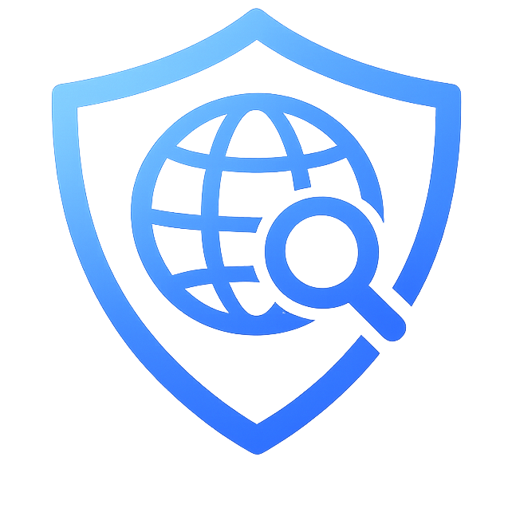

   
 
   # Akira Kiyosu · KoiNoYume7
 
   Switzerland · Swiss/Spanish · Age: <!-- AGE_START -->17<!-- AGE_END --> · <!-- DAYS_START -->1999<!-- DAYS_END --> days online
 
   *Automation-first hobby coder, getting into cybersecurity.*
 

 
 <!-- dob: 2008-09-15 -->
 
 ## About
 I build practical automation and tooling for Windows & Linux environments. I like systems that are reproducible, easy to bootstrap, and security-conscious.
 
 ## Focus
 - **Automation**: PowerShell, AutoHotkey (v1/v2), Bash, Python, JS.
 - **Security (learning)**: hardening, networking, access models, minimizing shared secrets, reliable logs
 - **Homelab**: Raspberry Pi 4, SMB, Tailscale, Cloudflared
 
 ## Featured project
 
 
 **[AnniProxy](https://github.com/KoiNoYume7/AnniProxy)** is a portable proxy-browser designed for barebones Windows setups.
 - Boots dependencies and starts a Cloudflared Access SSH proxy flow
 - Opens a local SOCKS5 tunnel and launches a portable Brave profile using it
 - Built with reliability in mind (bootstrap transcript + session logs)
 
 ## How I build (AI-assisted)
 I do a lot of *vibe coding* to iterate fast: I use AI to draft code, then I validate it by debugging, testing, and refining until it’s solid.
 
 ## Contact
 - **Discord**: `koinoyume7`
 - **Server**: https://discord.gg/uG2ncWseYz
 - **Email**: or if you feel old school, shoot me an email at `koinoyume7@gmail.com`.
 > my server is a bit quiet, but feel free to join if you want to chat or hang out with others :D
 
 ---
 *Cars · Code · Games · Music · Anime · Energy drinks*
